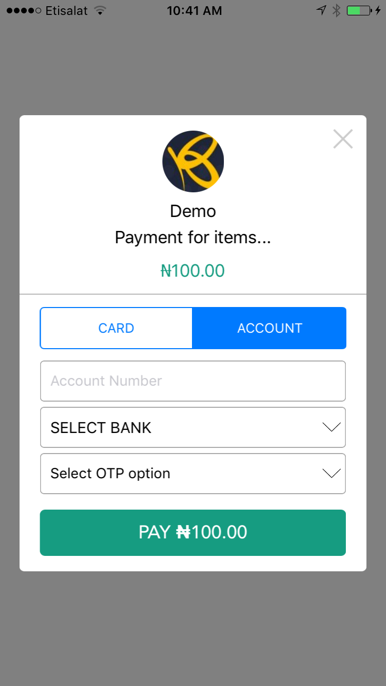
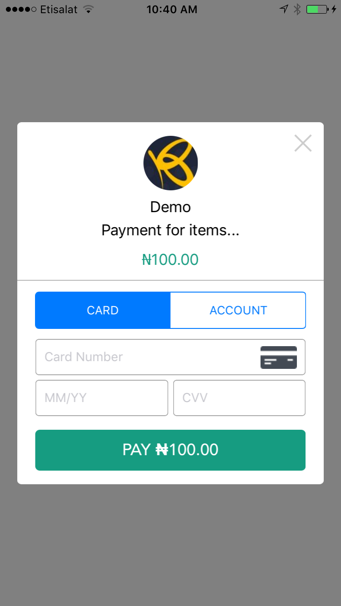

# Rave
Rave is an easy to implement library to interact with [Flutterwave](https://www.flutterwave.com/) API. It comes with in-built UI to collect credit card or bank details.

***



##Installation
Rave supports Swift 3.0+.
You can integrate Rave into your project manually. Drag the inner Rave folder into your project. Rave uses TripleDES for encryption and as such requires CommonCrypto. Create header bridge and import CommonCrypto.
`#import <CommonCrypto/CommonCrypto.h>`

## Basic usage 

```Swift
let publicKey = "FLWPUBK-bd19817370eb7aa5b89d8ac9f3f28a72"
let secretKey = "FLWSECK-5d413ec5aac3d462cf8b9f0d76113765"
let txRef = "rave-dash-1481777961"
let itemDescription = "Payment for items..."
let payerEmail = "example@example.com"
    
let ravePaymentManager = RavePaymentManager(publicKey, secretKey: secretKey, appName: "Demo", transactionDescription: "Payment for items...", amount: 100, email: "johnsonejezie@gmail.com", txRef: txRef)
ravePaymentManager?.country = "Nigeria"
ravePaymentManager?.logoImage = UIImage(named: "logo.jpg")
ravePaymentManager?.delegate = self
ravePaymentManager?.show()
```

Optional properties: You can also set the following optional property.

```Swift
currency:String //Default: Device Locale currency
country:String  //Default: Device regionCode will be used to get country
firstname:String
lastname:String
IP:String //If not set, the library uses "https://api.ipify.org?format=json" to get IP
narration:String
passcode:String
logoImage: UIImage
meta:[[String:Any]]

```

Delegate
```Swift
func ravePaymentManagerDidCancel(_ ravePaymentManager: RavePaymentManager) {
    print("cancel")
}

func ravePaymentManager(_ ravePaymentManager: RavePaymentManager, didCompletePaymentWithResult result: RavePaymentResult) {
   print(result.status)
   print(result.message)
 }
```
See Demo for more details.

